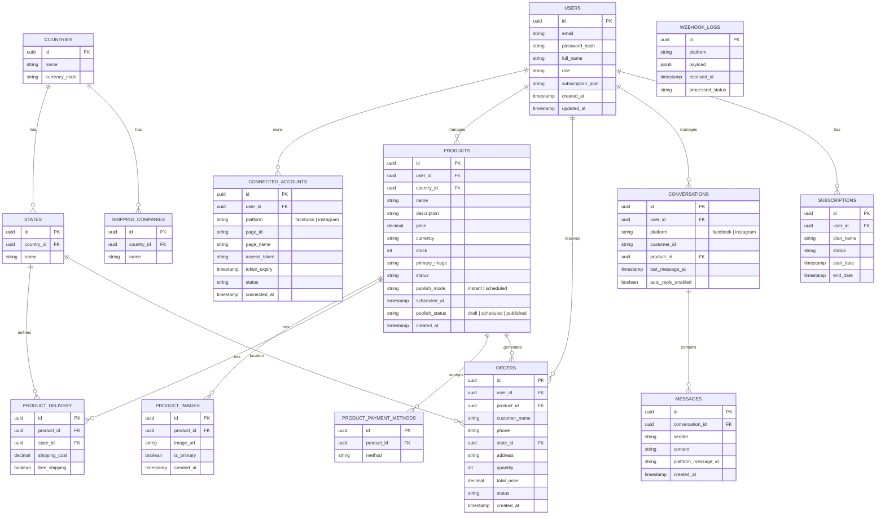

# ReplyGenie Database Schema

```mermaid
erDiagram
    USERS {
        uuid id PK
        string email
        string password_hash
        string full_name
        string role
        string subscription_plan
        timestamp created_at
        timestamp updated_at
    }

    CONNECTED_ACCOUNTS {
        uuid id PK
        uuid user_id FK
        string platform "facebook | instagram"
        string page_id
        string page_name
        string access_token
        timestamp token_expiry
        string status
        timestamp connected_at
    }

    COUNTRIES {
        uuid id PK
        string name
        string currency_code
    }

    STATES {
        uuid id PK
        uuid country_id FK
        string name
    }

    SHIPPING_COMPANIES {
        uuid id PK
        uuid country_id FK
        string name
    }

    PRODUCTS {
        uuid id PK
        uuid user_id FK
        uuid country_id FK
        string name
        string description
        decimal price
        string currency
        int stock
        string primary_image
        string status
        string publish_mode "instant | scheduled"
        timestamp scheduled_at
        string publish_status "draft | scheduled | published"
        timestamp created_at
    }

    PRODUCT_IMAGES {
        uuid id PK
        uuid product_id FK
        string image_url
        boolean is_primary
        timestamp created_at
    }

    PRODUCT_DELIVERY {
        uuid id PK
        uuid product_id FK
        uuid state_id FK
        decimal shipping_cost
        boolean free_shipping
    }

    PRODUCT_PAYMENT_METHODS {
        uuid id PK
        uuid product_id FK
        string method
    }

    ORDERS {
        uuid id PK
        uuid user_id FK
        uuid product_id FK
        string customer_name
        string phone
        uuid state_id FK
        string address
        int quantity
        decimal total_price
        string status
        timestamp created_at
    }

    CONVERSATIONS {
        uuid id PK
        uuid user_id FK
        string platform "facebook | instagram"
        string customer_id
        uuid product_id FK
        timestamp last_message_at
        boolean auto_reply_enabled
    }

    MESSAGES {
        uuid id PK
        uuid conversation_id FK
        string sender
        string content
        string platform_message_id
        timestamp created_at
    }

    WEBHOOK_LOGS {
        uuid id PK
        string platform
        jsonb payload
        timestamp received_at
        string processed_status
    }

    SUBSCRIPTIONS {
        uuid id PK
        uuid user_id FK
        string plan_name
        string status
        timestamp start_date
        timestamp end_date
    }

    USERS ||--o{ CONNECTED_ACCOUNTS : owns
    USERS ||--o{ PRODUCTS : manages
    USERS ||--o{ ORDERS : receives
    USERS ||--o{ CONVERSATIONS : manages
    USERS ||--o{ SUBSCRIPTIONS : has
    
    COUNTRIES ||--o{ STATES : has
    COUNTRIES ||--o{ SHIPPING_COMPANIES : has
    
    PRODUCTS ||--o{ PRODUCT_IMAGES : has
    PRODUCTS ||--o{ PRODUCT_DELIVERY : has
    PRODUCTS ||--o{ PRODUCT_PAYMENT_METHODS : accepts
    PRODUCTS ||--o{ ORDERS : generates
    
    CONVERSATIONS ||--o{ MESSAGES : contains
    
    STATES ||--o{ PRODUCT_DELIVERY : defines
    STATES ||--o{ ORDERS : location
```
